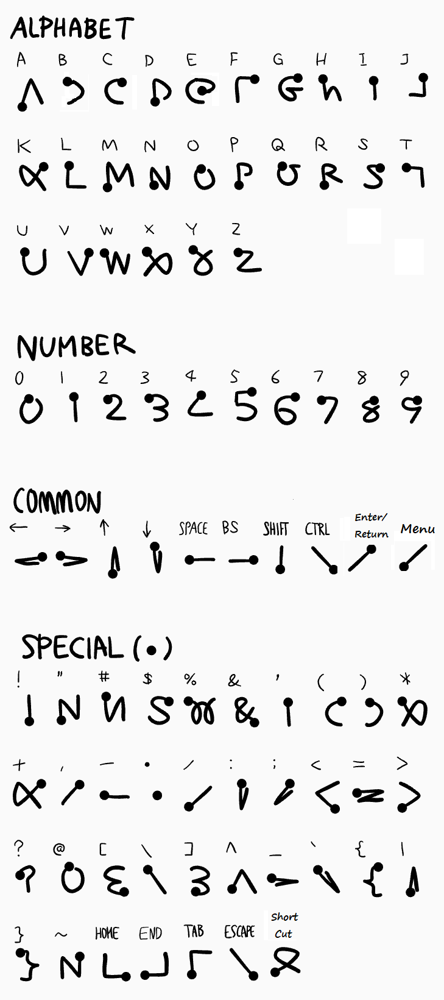

# android-unistroke-keyboard

Unistroke Handwriting Input Method for Programming

* Left pane for alphabet.
* Right pane for number.
* Tap enters special key mode.
* KEY button shows some useful key buttons.
* Long press enters cursor mode.

Changes to the original:

1. Made input area taller for use with higher resolution screens by increasing button height dimension.

2. Removed "cursor mode" entirely as it seemed to get triggered accidentally and caused much more trouble than it was worth.

3. Added double-tap of Key button to show pop-up of the cheat sheet.

4. Some additions to the alphabet gestures - especially "y" and "g" to make them more compatible with their Graffiti analogs.

5. Removed various items related to notifications and other stuff that made it difficult to build inside of my old, Eclipse environment.

6. Included the Gesture Builder apk since that is used to modify the raw resources in this app.

7. Added Graffiti Return/Enter stroke.

