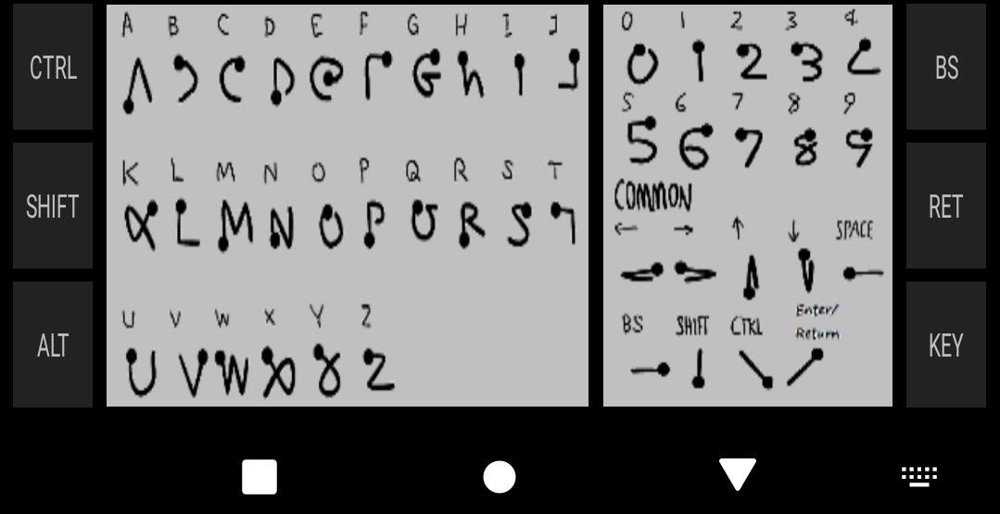

# android-unistroke-keyboard

Unistroke Handwriting Input Method for Programming

* Left pane for alphabet.
* Right pane for number.
* Tap enters special key mode.
* KEY button shows some useful key buttons.
* Long press enters cursor mode. REMOVED

Changes to the original:

1. Made input area taller for use with higher resolution screens (greater than 1920px in height) by increasing button height dimension from 36 to 60.

2. Removed "cursor mode" entirely as it seemed to get triggered accidentally and caused much more trouble than it was worth.

3. Added double-tap of Key button to show pop-up of the "cheat sheet".

4. Some changes to the alphabet gestures - added to "y", "g", and "5" to make them more compatible with their Graffiti analogs. Changed them for "b" and "e" entirely due to frustrating, consistent mis-recognition.

5. Removed various items related to notifications and other stuff that made it difficult to build inside of my old, Eclipse environment. NOTE: due to lack of a modern build environment and the use of an older target SDK to avoid file access issues,
there is no expectation this will build properly without at least some modifications to those configs.

6. Included the Gesture Builder apk since that is used to modify the raw resources in this app. (Note: this build of Gesture Builder is my own and differs from the one included in the SDK. It has a test activity and it is using a 3rd party recognizer in
the test activity called Point Cloud - see http://depts.washington.edu/acelab/proj/dollar/pdollar.html for details - so the quality of reported recognition may not match that of the keyboard code.)

7. Added Graffiti Return/Enter stroke.

8. Changed package id to avoid collisions as suggested here: https://github.com/tmatz/android-unistroke-keyboard/issues/28#issuecomment-3368561049

9. Added settings panel as launcher icon. Options include:

 * Log some information to the system logcat. You will need to use ADB or a logcat app to view this information.

 * Allow the app to read gestures from files of the appropriate names stored in the root of internal storage. This makes experimenting with gestures easier as no recompiling it required. However, it does require lowering the target SDK. So Android may
"warn" you. Results of this are shown in the app's logcat (if optionally enabled).

 * Show gesture recognition results/scores at the bottom of the input area.

 * Show "cheat sheet" as gesture input background.

